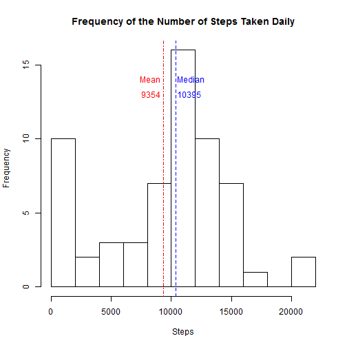
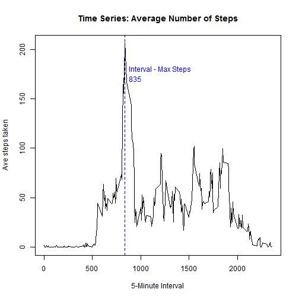
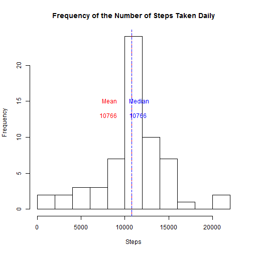

Reproducible Research: Peer Assessment 1  
================================================

>Author:  Cliff Weaver  
>Coursera Reproducible Reseach by Johns Hopkins   
>Date:  September 07, 2015

#Introduction
It is  possible to collect a large amount of data about personal movement using activity monitoring devices such as a Fitbit, Nike Fuelband, or Jawbone Up. These type of devices are part of the 'quantified self' movement ‚<U+0080><U+0093> a group of enthusiasts who take measurements about themselves regularly to improve their health, to find patterns in their behavior, or because they are tech geeks. But these data remain under-utilized both because the raw data are hard to obtain and there is a lack of statistical methods and software for processing and interpreting the data.

This assignment makes use of data from a personal activity monitoring device. This device collects data at 5 minute intervals through out the day. The data consists of two months of data from an anonymous individual collected during the months of October and November, 2012 and include the number of steps taken in 5 minute intervals each day.

#Data
The data for this assignment can be downloaded from Activity monitoring data [52K][https://d396qusza40orc.cloudfront.net/repdata%2Fdata%2Factivity.zip]

NOTE:  This data was downloaded for this exercise on August 8, 2015.

The variables included in this dataset are:

- Steps: Number of steps taking in a 5-minute interval (missing values are coded as NA)
- Date: The date on which the measurement was taken in YYYY-MM-DD format
- Interval: Identifier for the 5-minute interval in which measurement was taken

The dataset is stored in a comma-separated-value (CSV) file and there are a total of 17,568 observations in this dataset.

#Assignment
This assignment requies a written report that answers the questions detailed below. The results must be submitted in a single R markdown document that can be processed by knitr and be transformed into an HTML file.

The final report includes the code that you used to generate the output. echo = TRUE is used so that someone else is able to read the code. This assignment will be evaluated via peer assessment so it is essential evaluators be able to review the code for your analysis.

For the plotting aspects of this assignment, any plotting system in R can be used.

The assignment will be submitted by pushing  completed files into your forked repository on GitHub. The assignment submission consists of the URL to your GitHub repository and the SHA-1 commit ID for your repository state.

##Assignment Requirements:
1. Loading and preprocessing the data
2. What is mean total number of steps taken per day?
3. What is the average daily activity pattern?
4. Imputing missing values
5. Are there differences in activity patterns between weekdays and weekends?
6. Submitting the Assignment

##1. Loading and Preprocessing the Data
### Requirements:
Show any code that is needed to:

1. Load the data (i.e. read.csv())
2. Process/transform the data (if necessary) into a format suitable for your analysis

Before executing on the assignment plan, let's load dplyr - an R package I always relay on to modify data.

```r
library(dplyr)
```

Now let's load the data and take a look at it:


```r
if (!file.exists("../data/activity.zip")) {
     download.file("http://d396qusza40orc.cloudfront.net/repdata%2Fdata%2Factivity.zip", destfile="../data/activity.zip")
     unzip("../data/activity.zip")
     }
activity<- read.table(unzip("../data/activity.zip"), header=TRUE, sep=",", na.strings="NA")
glimpse(activity)
```

```
## Observations: 17568
## Variables:
## $ steps    (int) NA, NA, NA, NA, NA, NA, NA, NA, NA, NA, NA, NA, NA, N...
## $ date     (fctr) 2012-10-01, 2012-10-01, 2012-10-01, 2012-10-01, 2012...
## $ interval (int) 0, 5, 10, 15, 20, 25, 30, 35, 40, 45, 50, 55, 100, 10...
```
Since the date field is a factor, let's make it a real date field (not required but the right thing to do):

```r
activity$date<-as.Date(activity$date, "%Y-%m-%d")
glimpse(activity)
```

```
## Observations: 17568
## Variables:
## $ steps    (int) NA, NA, NA, NA, NA, NA, NA, NA, NA, NA, NA, NA, NA, N...
## $ date     (date) 2012-10-01, 2012-10-01, 2012-10-01, 2012-10-01, 2012...
## $ interval (int) 0, 5, 10, 15, 20, 25, 30, 35, 40, 45, 50, 55, 100, 10...
```
The steps above satisfy the requirements for the requirement *Loading and Preprocessing the Data*.

##2. What is mean total number of steps taken per day?
### Requirements:

For this part of the assignment, you can ignore the missing values in the dataset.

1. Calculate the total number of steps taken per day
2. If you do not understand the difference between a histogram and a barplot, research the difference between them.  Make a histogram of the total number of steps taken each day
3. Calculate and report the mean and median of the total number of steps taken per day

To easily summarize the data for this step, I use the dplyr package.


```r
activityDateStep <- activity %>% group_by(date) %>% summarize(total=sum(steps, na.rm=TRUE))
```
Let's take a look at the data now:

```r
glimpse(activityDateStep)
```

```
## Observations: 61
## Variables:
## $ date  (date) 2012-10-01, 2012-10-02, 2012-10-03, 2012-10-04, 2012-10...
## $ total (int) 0, 126, 11352, 12116, 13294, 15420, 11015, 0, 12811, 990...
```
Time to build the histogram:

```r
hist(activityDateStep$total, main="Frequency of the Number of Steps Taken Daily", xlab="Steps", breaks=15)
abline(v=mean(activityDateStep$total), lty=4, col="red")
text(9500, 14, "Mean",col="red", pos=2)
text(9500,13,format(mean(activityDateStep$total), digits=1),col="red", pos=2)
abline(v=median(activityDateStep$total), lty=2, col="blue")
text(10100, 14, "Median",col="blue", pos=4)
text(10100, 13, median(activityDateStep$total),col="blue", pos=4)
```

 

The steps above satisfy the requirements for the requirement *What is mean total number of steps taken per day*.

##3. What is the average daily activity pattern?
### Requirements:

What is the average daily activity pattern?

1. Make a time series plot (i.e. type = "l") of the 5-minute interval (x-axis) and the average number of steps taken, averaged across all days (y-axis)
2. Which 5-minute interval, on average across all the days in the dataset, contains the maximum number of steps?

First calculate the mean steps for each 5 minute interval.  Then I identify the 5 minute interval that 
has the highest average number of steps across all days in the dataset.  I am doing this first so I can include the information on the times series plot.


```r
aveSteps <- activity %>% group_by(interval) %>% summarize(steps=mean(steps, na.rm=TRUE))
plot(aveSteps, type="l", main="Time Series: Average Number of Steps", xlab="5-Minute Interval", 
     ylab="Ave steps taken")
maxInterval<-aveSteps[which.max(aveSteps$steps),1]
abline(v=maxInterval, lty=2, col="blue")
text(maxInterval, 180, "Interval - Max Steps",col="blue", pos=4)
text(maxInterval, 170, maxInterval, col="blue", pos=4)
```

 

```r
#Might as well get the highest average number of steps taken too:
maxSteps <- filter(aveSteps, interval==maxInterval$interval)
maxSteps <- round(maxSteps[,2],0)
```

The 5 minute time interval starting at 835 has the highest average number of steps (206) across all days in the dataset.

The steps above satisfy the requirements for the requirement *What is the average daily activity pattern?*.

##4. Imputing missing values
### Requirements:

Note that there are a number of days/intervals where there are missing values (coded as NA). The presence of missing days may introduce bias into some calculations or summaries of the data.

1. Calculate and report the total number of missing values in the dataset (i.e. the total number of rows with NAs)
2. Devise a strategy for filling in all of the missing values in the dataset. The strategy does not need to be sophisticated. For example, you could use the mean/median for that day, or the mean for that 5-minute interval, etc.
3. Create a new dataset that is equal to the original dataset but with the missing data filled in.
4. Make a histogram of the total number of steps taken each day and Calculate and report the mean and median total number of steps taken per day. Do these values differ from the estimates from the first part of the assignment? What is the impact of imputing missing data on the estimates of the total daily number of steps?

Calculating the number of NAs in the dataset is straight forword:

```r
sumNA <- sum(is.na(activity$steps))
sumNA
```

```
## [1] 2304
```
There are 2304 NAs in the dataset.

Replacing the NA values with another value requires some attention.  First, I'll make a copy of the data to preserve the original.  Then the code replaces the NA values in the replicated dataset with the interval averages.


```r
activityNEW <- activity #Make copy of the data
#Goup data by interval and then find the interval mean
activityIntervalStepAve <- activityNEW %>% group_by(interval) %>% summarize(average=mean(steps, na.rm=TRUE))
```
Let's take a look at the new table activityIntervalStepAve with the step average for some random intervals:

```r
activityIntervalStepAve %>% sample_n(5)
```

```
## Source: local data frame [5 x 2]
## 
##   interval     average
## 1     2235   2.2075472
## 2      645  44.1698113
## 3     2350   0.2264151
## 4     1925  20.7169811
## 5      815 157.5283019
```
The next step is to match the intervals in the new table with the existing table:

```r
activityNEW$average <- activityIntervalStepAve$average[activityIntervalStepAve$interval %in% activityNEW$interval]
```
Let's look at a few random records in the data set now - notice additional column but the NAs are still present.

```r
activityNEW %>% sample_n(5)
```

```
##       steps       date interval   average
## 13643     0 2012-11-17      850 183.39623
## 9349      0 2012-11-02     1100  31.35849
## 8032    172 2012-10-28     2115  19.24528
## 16582     0 2012-11-27     1345  53.54717
## 10553   188 2012-11-06     1520  45.96226
```
Let's replace NAs with the averages for each interval:

```r
activityNEW <- activityNEW %>% mutate(steps=ifelse(is.na(activityNEW$steps),activityNEW$average, activityNEW$steps))
```
Let's take a final look at the data set before we draw the histogram.  Note that the NAs have been replaced by the interval averages.

```r
activityNEW %>% sample_n(5)
```

```
##             steps       date interval     average
## 7839    0.0000000 2012-10-28      510   3.0000000
## 16220   0.0000000 2012-11-26      735  44.3207547
## 9807    0.1509434 2012-11-04      110   0.1509434
## 2979  619.0000000 2012-10-11      810 129.4339623
## 14913  37.0000000 2012-11-21     1840  85.3396226
```
Now we will draw the histogram.  We will use the same procedure as we did before.

```r
#Develop the data like the histogram before
activityDateStep2 <- activityNEW %>% group_by(date) %>% summarize(total=sum(steps, na.rm=TRUE))
#Write the new histogram
hist(activityDateStep2$total, main="Frequency of the Number of Steps Taken Daily", xlab="Steps", breaks=15)
abline(v=mean(activityDateStep2$total), lty=4, col="red")
text(9500, 15, "Mean",col="red", pos=2)
text(9500,13,format(mean(activityDateStep2$total), digits=1),col="red", pos=2)
abline(v=median(activityDateStep2$total), lty=2, col="blue")
text(10100, 15, "Median",col="blue", pos=4)
text(10100, 13, format(median(activityDateStep2$total), digits=1),col="blue", pos=4)
```

 

Comparing this histogram to the first one, differences are observed - and they make sense.  Because the NAs have been replaced by the interval means, the median and mean converged.

The steps above satisfy the requirements for the requirement *Imputing missing values*.

##5. Are there differences in activity patterns between weekdays and weekends?
### Requirements:

For this part the weekdays() function may be of some help here. Use the dataset with the filled-in missing values for this part.

1. Create a new factor variable in the dataset with two levels ‚<U+0080><U+0093> ‚<U+0080><U+009C>weekday‚<U+0080>ù and ‚<U+0080><U+009C>weekend‚<U+0080>ù indicating whether a given date is a weekday or weekend day.
2. Make a panel plot containing a time series plot (i.e. type = "l") of the 5-minute interval (x-axis) and the average number of steps taken, averaged across all weekday days or weekend days (y-axis). See the README file in the GitHub repository to see an example of what this plot should look like using simulated data.


```r
# Calculate the weekdays
dayType <- weekdays(activityNEW$date)
# Assign the weekdays and the weekends to the data set
dayType <- ifelse(test = dayType %in% c("Saturday", "Sunday"), yes="weekend", "weekday")
activityNEW$dayType <- as.factor(dayType)
```
Let's take a look:

```r
head(activityNEW)
```

```
##       steps       date interval   average dayType
## 1 1.7169811 2012-10-01        0 1.7169811 weekday
## 2 0.3396226 2012-10-01        5 0.3396226 weekday
## 3 0.1320755 2012-10-01       10 0.1320755 weekday
## 4 0.1509434 2012-10-01       15 0.1509434 weekday
## 5 0.0754717 2012-10-01       20 0.0754717 weekday
## 6 2.0943396 2012-10-01       25 2.0943396 weekday
```
Let's now draw the required plots:

```r
aveStepsInt <- activityNEW %>% group_by(interval) %>% summarize(steps=mean(steps, na.rm=TRUE))
par(mfrow = c(2, 1))
for (type in c("weekend", "weekday")) {
     steps.type <- aggregate(steps ~ interval, data = activityNEW, subset = activityNEW$dayType == 
                                  type, FUN = mean)
     plot(steps.type, type = "l", main = type)
}
```

 

There is more activity on the weekends than during the week.

##6. Submitting the Assignment
### Requirements:

To submit the assignment:

1. Commit the your completed PA1_template.Rmd file to the master branch of your git repository (you should already be on the master branch unless you created new ones) **Completed**
2. Commit your PA1_template.md and PA1_template.html files produced by processing your R markdown file with knit2html() function in R (from the knitr package) by running the function from the console. **Completed**
3. If your document has figures included (it should) then they should have been placed in the figure/ directory by default (unless you overrided the default). Add and commit the figure/ directory to yoru git repository so that the figures appear in the markdown file when it displays on github. **Completed**
4. Push your master branch to GitHub. **Completed**
5. Submit the URL to your GitHub repository for this assignment on the course web site. **Completed**

In addition to submitting the URL for your GitHub repository, you will need to submit the 40 character SHA-1 hash (as string of numbers from 0-9 and letters from a-f) that identifies the repository commit that contains the version of the files you want to submit. You can do this in GitHub by doing the following

A valid submission will look something like (this is just an example) **Completed**

>https://github.com/rdpeng/RepData_PeerAssessment1  
>7c376cc5447f11537f8740af8e07d6facc3d9645

---------------------------

####A Description of the Environment this Analysis was Performed:

```r
sessionInfo()
```

```
## R version 3.2.1 (2015-06-18)
## Platform: x86_64-w64-mingw32/x64 (64-bit)
## Running under: Windows 8 x64 (build 9200)
## 
## locale:
## [1] LC_COLLATE=English_United States.1252 
## [2] LC_CTYPE=English_United States.1252   
## [3] LC_MONETARY=English_United States.1252
## [4] LC_NUMERIC=C                          
## [5] LC_TIME=English_United States.1252    
## 
## attached base packages:
## [1] stats     graphics  grDevices utils     datasets  methods   base     
## 
## other attached packages:
## [1] dplyr_0.4.2  knitr_1.10.5
## 
## loaded via a namespace (and not attached):
##  [1] Rcpp_0.11.6      digest_0.6.8     assertthat_0.1   mime_0.3        
##  [5] R6_2.1.0         DBI_0.3.1        formatR_1.2      magrittr_1.5    
##  [9] evaluate_0.7     highr_0.5        stringi_0.5-5    lazyeval_0.1.10 
## [13] rmarkdown_0.7    tools_3.2.1      stringr_1.0.0    markdown_0.7.7  
## [17] parallel_3.2.1   rsconnect_0.3.79 htmltools_0.2.6
```
